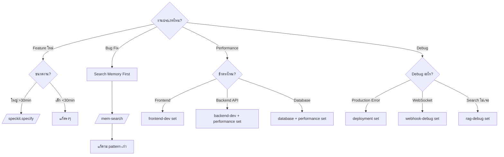
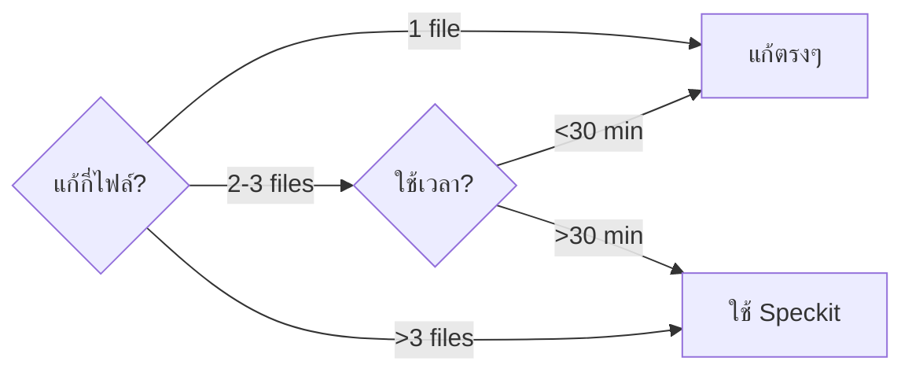
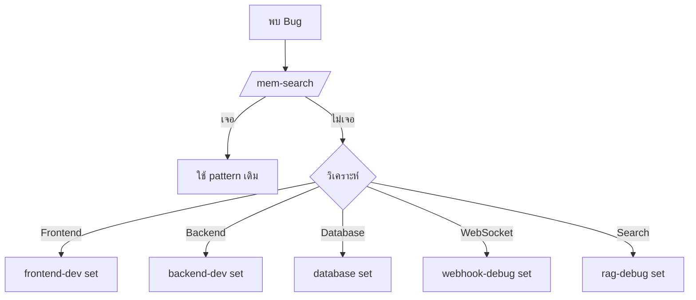
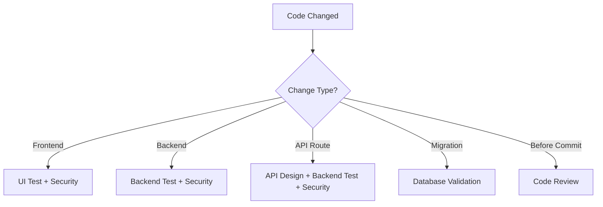
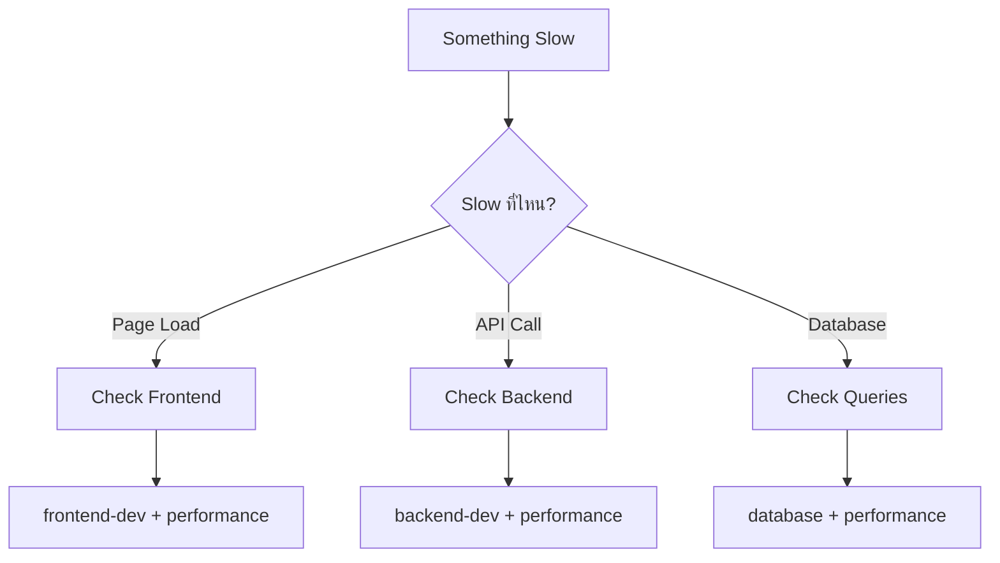
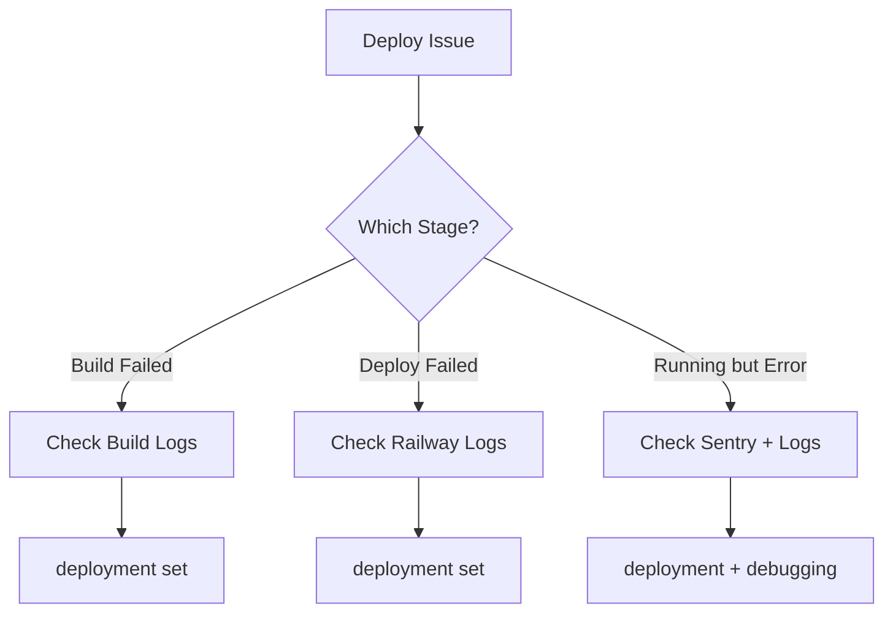
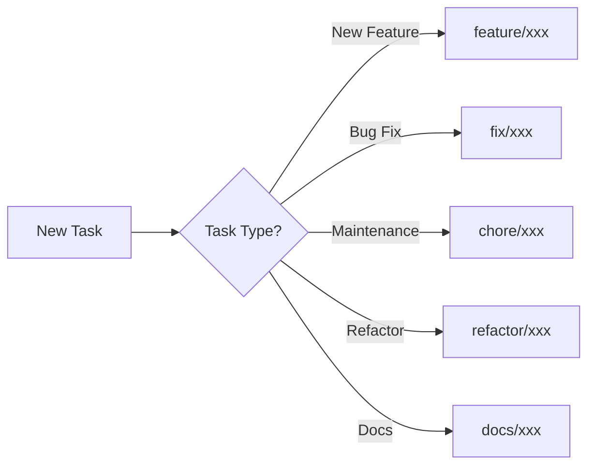

# Decision Trees

คู่มือการตัดสินใจเลือก Tools, Agents, และ Workflows

## 🎯 Main Decision Flow



---

## 1. Feature Development

### คำถาม: งานใหญ่แค่ไหน?



### Decision Table

| Criteria | Action | Tool |
|----------|--------|------|
| แก้ 1 ไฟล์ + <15 นาที | แก้ตรงๆ | ไม่ต้องใช้ tool พิเศษ |
| แก้ 2-3 ไฟล์ + <30 นาที | ใช้ agent set | frontend-dev/backend-dev |
| แก้ >3 ไฟล์ หรือ >30 นาที | ใช้ Speckit | /speckit.specify |
| Feature ซับซ้อน | ใช้ Speckit | /speckit.specify + /speckit.plan |

### Examples

```
❓ "เพิ่มปุ่ม logout"
→ แก้ 1 ไฟล์, <10 นาที
→ ไม่ต้องใช้ Speckit ✅

❓ "สร้าง dashboard แสดง statistics"
→ แก้หลายไฟล์ (frontend + backend + DB)
→ ใช้ Speckit ✅

❓ "แก้สี button"
→ แก้ 1 ไฟล์, <5 นาที
→ แก้ตรงๆ ✅

❓ "เพิ่ม real-time notifications"
→ แก้หลายไฟล์ (WebSocket + Events + UI)
→ ใช้ Speckit ✅
```

---

## 2. Bug Fixing

### Decision Flow



### Memory Search First!

**Always search memory ก่อนแก้ bug:**
```bash
/mem-search "race condition profile"
/mem-search "validation error"
/mem-search "WebSocket disconnect"
```

**Why?**
- เคยแก้แล้วอาจแก้ซ้ำ
- มี pattern ที่ work แล้ว
- ประหยัดเวลา 50-70%

### Bug Type → Agent Set

| Bug Type | Agent Set | Example |
|----------|-----------|---------|
| UI ไม่ render | frontend-dev | "ปุ่มไม่แสดง" |
| API error | backend-dev | "POST /bots returns 500" |
| Query ช้า | database + performance | "conversations โหลดช้า" |
| WebSocket ขาด | webhook-debug | "message ไม่ update realtime" |
| Search ไม่เจอ | rag-debug | "ค้นหาภาษาไทยไม่เจอ" |
| Deploy ล้ม | deployment | "Railway deploy failed" |

---

## 3. Which Agent Set?

### Quick Selector

| Task Keywords | Set | Why |
|--------------|-----|-----|
| "สร้าง component", "ปรับ UI", "แก้ styling" | frontend-dev | UI/UX work |
| "สร้าง API", "แก้ controller", "service layer" | backend-dev | Backend logic |
| "migration", "query ช้า", "เพิ่ม column" | database | Database work |
| "semantic search", "embedding", "ผลลัพธ์ไม่ตรง" | rag-debug | RAG/Search issues |
| "webhook ไม่ทำงาน", "message ไม่เข้า", "realtime" | webhook-debug | WebSocket/Webhook |
| "โหลดช้า", "optimize", "performance" | performance | Performance issues |
| "review code", "ก่อน commit" | code-review | Code quality |
| "security audit", "vulnerability" | security | Security review |
| "ออกแบบ API", "REST" | api-design | API design |
| "test UI", "responsive" | ui-test | UI testing |
| "เขียน test", "unit test" | backend-test | Backend testing |
| "test flow", "E2E" | integration-test | Integration testing |
| "deploy ล้ม", "production error" | deployment | Deployment issues |
| "หางานเก่า", "เคยทำไหม" | memory | Memory search |

### Decision Matrix

| Criteria | frontend-dev | backend-dev | database |
|----------|-------------|-------------|----------|
| แก้ .tsx/.jsx | ✅ | - | - |
| แก้ .php (controller) | - | ✅ | - |
| แก้ .php (migration) | - | - | ✅ |
| ปรับ UI/styling | ✅ | - | - |
| แก้ API logic | - | ✅ | - |
| Query optimization | - | - | ✅ |
| React Query issue | ✅ | - | - |
| WebSocket | webhook-debug | - | - |

---

## 4. Testing Strategy

### When to Test?



### Auto-Trigger Rules

| After... | Run... | Why |
|----------|--------|-----|
| Frontend edit | ui-test + security | ตรวจ UI render, security |
| Backend edit | backend-test + security | ตรวจ logic, security |
| Route change | api-design + backend-test + security | ตรวจ API standards |
| Migration | database set | Validate migration |
| Before commit | code-review | Final check |

---

## 5. Performance Issues

### Diagnostic Flow



### Performance Checklist

| Symptom | Check | Tool |
|---------|-------|------|
| Page load ช้า | Bundle size, images | performance set |
| API response ช้า | Query time, N+1 | performance set |
| Database ช้า | Indexes, explain plan | database set |
| AI evaluation ช้า | Model selection, cache | backend-dev set |

---

## 6. Deployment Issues

### Deployment Decision Tree



### Common Issues

| Issue | First Check | Tool |
|-------|-------------|------|
| Build ล้ม | Build logs | deployment set |
| Deploy timeout | Railway dashboard | deployment set |
| Env vars ไม่ทำงาน | Railway variables | deployment set |
| Production error | Sentry | deployment set |
| Service ไม่ start | Railway logs | deployment set |

---

## 7. Git Workflow

### Branch Decision



### Commit Strategy

| Situation | Strategy | Command |
|-----------|----------|---------|
| Small fix | Single commit | `git commit -m "fix: ..."` |
| Feature work | Multiple commits | Commit at logical points |
| Ready for PR | Create PR | `/commit-push-pr` |

---

## 8. Documentation

### When to Update Docs?

| Change | Update | Location |
|--------|--------|----------|
| New API endpoint | API docs | docs/api-standards.md |
| New gotcha found | Gotchas | docs/gotchas.md |
| New pattern | Best practices | Relevant doc |
| Architecture change | Design docs | specs/ |

---

## Quick Reference Cards

### Card 1: "I need to..."

| Need | Action |
|------|--------|
| สร้าง feature ใหม่ | /speckit.specify |
| แก้ bug | /mem-search first |
| ปรับ UI | frontend-dev set |
| แก้ API | backend-dev set |
| Query ช้า | database + performance |
| Deploy ล้ม | deployment set |
| Review code | code-review set |

### Card 2: "Something is broken..."

| Problem | Solution |
|---------|----------|
| UI ไม่แสดง | frontend-dev set |
| API error | backend-dev set + check Sentry |
| Database error | database set + check Neon |
| WebSocket ไม่ทำงาน | webhook-debug set |
| Search ไม่เจอ | rag-debug set |
| Deploy failed | deployment set + Railway logs |

### Card 3: "I'm not sure..."

| Question | Answer |
|----------|--------|
| ใช้ Speckit ไหม? | >3 files หรือ >30min = Yes |
| Agent set ไหน? | ดู keywords ในตาราง Quick Selector |
| Test อย่างไร? | ดู Auto-Trigger Rules |
| Memory search ไหม? | Bug fix = ต้อง search |

---

## Common Patterns

### Pattern 1: New Feature
```
1. /speckit.specify "feature description"
2. /speckit.plan
3. /speckit.implement
4. (auto) code-review set
5. /commit-push-pr
```

### Pattern 2: Bug Fix
```
1. /mem-search "bug description"
2. Use appropriate set (frontend/backend/database)
3. Fix
4. (auto) code-review set
5. /commit-push-pr
```

### Pattern 3: Performance Issue
```
1. Identify bottleneck (frontend/backend/database)
2. Use performance set
3. Optimize
4. Measure improvement
5. /commit-push-pr
```

---

## Tips

1. **When in doubt, ask!**
   - System จะแนะนำ set ที่เหมาะสม

2. **Memory first for bugs**
   - เคยแก้แล้วอาจมี solution

3. **Speckit for big features**
   - >30 นาที = ควรใช้ Speckit

4. **Multiple sets OK**
   - เช่น: backend-dev → backend-test → code-review

5. **Auto-triggers เพื่อคุณ**
   - ไม่ต้องกังวล จะ trigger อัตโนมัติ
