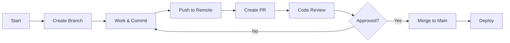

# Git Flow & Workflow

Git workflow โดยละเอียดสำหรับโปรเจกต์ BotFacebook

## Branch Strategy

```
main (production)
  │
  ├── feature/user-authentication   ← New features
  ├── feature/bot-dashboard
  ├── fix/race-condition-profile   ← Bug fixes
  ├── fix/webhook-timeout
  ├── chore/update-dependencies    ← Maintenance
  └── chore/improve-docs
```

### Branch Naming Convention

| Type | Pattern | Example | ใช้เมื่อ |
|------|---------|---------|---------|
| Feature | `feature/description` | `feature/user-profile` | เพิ่ม feature ใหม่ |
| Fix | `fix/description` | `fix/login-error` | แก้ bug |
| Chore | `chore/description` | `chore/update-deps` | Maintenance |
| Refactor | `refactor/description` | `refactor/service-layer` | ปรับโครงสร้าง code |
| Docs | `docs/description` | `docs/api-guide` | Documentation only |

---

## Workflow Overview



---

## Step-by-Step Workflow

### 1. ก่อนเริ่มงาน - Create Branch

```bash
# Update main branch
git checkout main
git pull origin main

# Create feature branch
git checkout -b feature/user-profile

# Or fix branch
git checkout -b fix/login-timeout
```

---

### 2. ระหว่างทำงาน - Commit Often

```bash
# Check status
git status

# Stage changes
git add .

# Commit with conventional commits
git commit -m "feat: add user profile page"
git commit -m "fix: resolve race condition in profile creation"
git commit -m "chore: update dependencies"
```

### Conventional Commits Format

```
<type>(<scope>): <subject>

<body>

<footer>
```

**Types:**
```
feat:     New feature
fix:      Bug fix
docs:     Documentation only
style:    Formatting, missing semicolons, etc
refactor: Code change that neither fixes bug nor adds feature
test:     Adding or updating tests
chore:    Maintenance (deps, config, etc)
```

**Examples:**
```bash
# Simple
git commit -m "feat: add user authentication"

# With scope
git commit -m "feat(auth): add JWT token validation"

# With body
git commit -m "fix: resolve race condition in customer profile

Added transaction lock to prevent duplicate profile creation
when multiple requests arrive simultaneously.

Closes #94"

# Breaking change
git commit -m "feat!: change API response format

BREAKING CHANGE: API now returns data in {data, meta, errors} format"
```

---

### 3. Push & Create PR

#### Option A: ใช้ `/commit-push-pr` (Recommended)
```bash
# Auto: commit + push + create PR
/commit-push-pr
```

#### Option B: Manual
```bash
# Push branch
git push -u origin feature/user-profile

# Create PR with gh CLI
gh pr create --title "feat: Add user profile management" --body "## Summary
- Added user profile page
- Added profile edit functionality
- Added avatar upload

## Test Plan
- [ ] Test profile view
- [ ] Test profile edit
- [ ] Test avatar upload

🤖 Generated with Claude Code"
```

---

### 4. Code Review Process

#### For Author (ผู้สร้าง PR)
```bash
# ดู PR status
gh pr view

# ตอบ comments
gh pr comment 123 --body "Fixed as suggested"

# Push updates
git add .
git commit -m "fix: address review comments"
git push
```

#### For Reviewer
```bash
# List open PRs
gh pr list --state open

# View PR details
gh pr view 123

# Check out PR locally
gh pr checkout 123

# Approve PR
gh pr review 123 --approve

# Request changes
gh pr review 123 --request-changes --body "Please add tests"

# Comment
gh pr review 123 --comment --body "LGTM with minor suggestions"
```

---

### 5. Merge to Main

```bash
# Merge strategies
gh pr merge 123 --squash   # ✅ Recommended - Clean history
gh pr merge 123 --merge    # OK - Preserve all commits
gh pr merge 123 --rebase   # OK - Linear history
```

**When to Use Each:**
- **Squash** (แนะนำ): Feature PRs (รวม commits เป็น 1)
- **Merge**: Keep detailed commit history
- **Rebase**: Linear history preferred

---

### 6. After Merge - Cleanup

```bash
# Delete local branch
git branch -d feature/user-profile

# Delete remote branch (auto-deleted by GitHub if configured)
git push origin --delete feature/user-profile

# Or use gh CLI
gh pr close 123 --delete-branch
```

---

## Commit Message Guidelines

### Good Commit Messages
```
✅ feat: add user profile page
✅ fix: resolve race condition in profile creation
✅ chore(deps): update Laravel to 12.0
✅ refactor: extract service layer from controller
✅ docs: add API documentation for user endpoints
✅ test: add unit tests for SecondAI service
```

### Bad Commit Messages
```
❌ update
❌ fix bug
❌ changes
❌ wip
❌ asdfasdf
❌ Final commit (really this time)
```

### Commit Message Template
```bash
# .gitmessage
# <type>(<scope>): <subject> (max 50 chars)
# |<----  Using a Maximum Of 50 Characters  ---->|

# Explain why this change is being made
# |<----   Try To Limit Each Line to a Maximum Of 72 Characters   ---->|

# Provide links or keys to any relevant tickets, articles or other resources
# Example: Closes #123

# --- COMMIT END ---
# Type: feat, fix, docs, style, refactor, test, chore
# Scope: Component or feature area
# Subject: Short summary (imperative mood)
#
# Remember:
# - Capitalize first word
# - Use imperative mood ("add" not "added")
# - No period at end
# - Separate subject from body with blank line
```

```bash
# Set template
git config --global commit.template ~/.gitmessage
```

---

## PR Best Practices

### PR Title
```
✅ feat: Add user profile management
✅ fix: Resolve race condition in customer creation
✅ chore: Update dependencies to latest versions

❌ Profile feature
❌ Bug fix
❌ Updates
```

### PR Description Template
```markdown
## Summary
<!-- Brief description of changes -->

## Changes
- Added user profile page
- Implemented profile edit functionality
- Added avatar upload feature

## Test Plan
- [ ] Manual testing completed
- [ ] Unit tests added/updated
- [ ] Integration tests passed

## Screenshots (if applicable)
<!-- Add screenshots for UI changes -->

## Related Issues
Closes #123
Fixes #456

## Breaking Changes
<!-- List any breaking changes, or write "None" -->

🤖 Generated with [Claude Code](https://claude.com/claude-code)
```

### PR Size Guidelines
```
✅ Small PR (< 400 lines): Easy to review
⚠️ Medium PR (400-800 lines): OK but needs time
❌ Large PR (> 800 lines): Split into smaller PRs
```

---

## Merge Conflicts

### Prevention
```bash
# Update branch regularly
git checkout feature/my-feature
git pull origin main
git rebase main

# Or use merge
git merge main
```

### Resolution
```bash
# If conflict occurs during rebase
git checkout feature/my-feature
git rebase main

# Fix conflicts in files
# Then:
git add .
git rebase --continue

# Push (force if needed after rebase)
git push --force-with-lease
```

---

## Git Commands Reference

### Daily Commands
```bash
# Status & changes
git status
git diff
git diff --staged

# Staging
git add .
git add -p  # Interactive staging

# Committing
git commit -m "message"
git commit --amend  # Modify last commit

# Branching
git branch  # List branches
git checkout -b new-branch
git checkout existing-branch
git branch -d branch-name  # Delete

# Remote
git fetch
git pull
git push
git push -u origin branch-name
```

### Undoing Changes
```bash
# Unstage file
git reset HEAD file.txt

# Discard local changes
git checkout -- file.txt
git restore file.txt  # Git 2.23+

# Undo last commit (keep changes)
git reset --soft HEAD~1

# Undo last commit (discard changes)
git reset --hard HEAD~1

# Revert commit (create new commit)
git revert abc123
```

### Advanced
```bash
# Interactive rebase (cleanup commits)
git rebase -i HEAD~3

# Cherry-pick commit
git cherry-pick abc123

# Stash changes
git stash
git stash pop
git stash list

# Search commits
git log --grep="search term"
git log --author="name"
```

---

## GitHub CLI (gh) Quick Reference

### PRs
```bash
# Create PR
gh pr create

# List PRs
gh pr list
gh pr list --state open
gh pr list --author @me

# View PR
gh pr view 123
gh pr view --web  # Open in browser

# Checkout PR
gh pr checkout 123

# Review PR
gh pr review 123 --approve
gh pr review 123 --comment
gh pr review 123 --request-changes

# Merge PR
gh pr merge 123 --squash
gh pr merge 123 --merge
gh pr merge 123 --rebase

# Close PR
gh pr close 123
gh pr close 123 --delete-branch
```

### Issues
```bash
# Create issue
gh issue create

# List issues
gh issue list

# View issue
gh issue view 123

# Close issue
gh issue close 123
```

### Repo
```bash
# Clone
gh repo clone owner/repo

# View
gh repo view
gh repo view --web

# Fork
gh repo fork
```

---

## Troubleshooting

### "Failed to push"
```bash
# Someone else pushed - rebase first
git pull --rebase origin main
git push
```

### "Merge conflict"
```bash
# Accept theirs
git checkout --theirs file.txt

# Accept ours
git checkout --ours file.txt

# Manual merge
# Edit file, then:
git add file.txt
git rebase --continue
```

### "Accidentally committed to main"
```bash
# Create branch from current state
git branch feature/my-work

# Reset main to origin
git checkout main
git reset --hard origin/main

# Continue work on feature branch
git checkout feature/my-work
```

### "Need to undo multiple commits"
```bash
# Reset to specific commit (keep changes)
git reset --soft abc123

# Reset to specific commit (discard changes)
git reset --hard abc123

# Push force (be careful!)
git push --force-with-lease
```

---

## Best Practices Summary

### ✅ Do
- Commit often with clear messages
- Use conventional commits format
- Create small, focused PRs
- Update branch before merging
- Delete branches after merge
- Use `/commit-push-pr` for automation

### ❌ Don't
- Commit directly to main
- Use generic commit messages
- Create huge PRs (> 800 lines)
- Force push to main
- Leave stale branches
- Commit secrets/credentials

---

## Resources

- [Conventional Commits](https://www.conventionalcommits.org/)
- [GitHub CLI Manual](https://cli.github.com/manual/)
- [Git Documentation](https://git-scm.com/doc)
