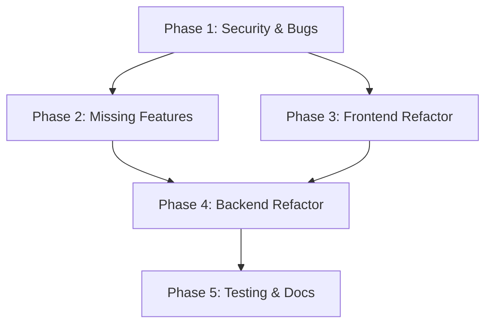

# Implementation Plan: Bots Page Comprehensive Refactoring

**Branch**: `006-bots-refactor` | **Date**: 2026-01-09 | **Spec**: [spec.md](./spec.md)
**Input**: Feature specification from `/specs/006-bots-refactor/spec.md`

## Summary

Comprehensive 5-phase refactoring of the Bots management system addressing critical security vulnerabilities (credential exposure, race conditions, N+1 queries), completing missing features (Facebook integration, Plugins, External Data Sources), improving frontend maintainability through component splitting, restructuring backend data models, and establishing comprehensive testing and documentation.

## Technical Context

**Language/Version**: PHP 8.2 (Backend), TypeScript 5.x (Frontend)
**Primary Dependencies**: Laravel 12, React 19, TanStack Query v5, Zustand
**Storage**: PostgreSQL (Neon) with pgvector extension
**Testing**: PHPUnit (Backend), Vitest (Frontend), Playwright (E2E)
**Target Platform**: Web application (Railway deployment)
**Project Type**: Web application (separate backend/frontend)
**Performance Goals**: API response <500ms, Admin list with 50 admins <500ms, 99.9% webhook success rate
**Constraints**: Zero-downtime migration, backwards compatible API changes
**Scale/Scope**: Multi-tenant SaaS, ~50+ settings fields, 13 bot-related API endpoints, 3 channel integrations

## Constitution Check

*GATE: Must pass before Phase 0 research. Re-check after Phase 1 design.*

**Status**: PASS - No project-specific constitution defined. Using Laravel/React best practices as implicit guidelines.

**Implicit Guidelines Applied**:
1. Laravel service layer pattern for business logic
2. React component composition for UI
3. TanStack Query for server state management
4. PHPUnit for backend testing
5. Database transactions for data integrity

## Project Structure

### Documentation (this feature)

```text
specs/006-bots-refactor/
├── spec.md              # Feature specification
├── plan.md              # This file
├── research.md          # Phase 0 output
├── data-model.md        # Phase 1 output
├── quickstart.md        # Phase 1 output
├── contracts/           # Phase 1 output (OpenAPI specs)
│   ├── bots-api.yaml
│   ├── bot-settings-api.yaml
│   └── webhooks-api.yaml
├── checklists/          # Validation checklists
│   └── requirements.md
└── tasks.md             # Phase 2 output (from /speckit.tasks)
```

### Source Code (repository root)

```text
backend/
├── app/
│   ├── Http/
│   │   ├── Controllers/
│   │   │   ├── Api/
│   │   │   │   ├── BotController.php         # Modify: credential masking
│   │   │   │   ├── BotSettingController.php  # Modify: validation
│   │   │   │   └── AdminController.php       # Modify: N+1 fix
│   │   │   └── Webhook/
│   │   │       ├── LINEWebhookController.php
│   │   │       ├── TelegramWebhookController.php
│   │   │       └── FacebookWebhookController.php  # NEW
│   │   ├── Requests/
│   │   │   └── Flow/
│   │   │       └── UpdateFlowRequest.php     # Modify: KB validation
│   │   └── Resources/
│   │       └── BotResource.php               # Modify: credential hiding
│   ├── Jobs/
│   │   ├── ProcessLINEWebhook.php
│   │   ├── ProcessTelegramWebhook.php
│   │   └── ProcessFacebookWebhook.php        # NEW
│   ├── Models/
│   │   ├── Bot.php                           # Modify: encryption
│   │   ├── BotSetting.php                    # Split into sub-models
│   │   ├── BotLimits.php                     # NEW
│   │   ├── BotHITLSettings.php               # NEW
│   │   ├── BotAggregationSettings.php        # NEW
│   │   ├── BotResponseHours.php              # NEW
│   │   ├── Flow.php                          # Modify: audit trail
│   │   └── FlowAuditLog.php                  # NEW
│   ├── Policies/
│   │   └── BotPolicy.php                     # Review: admin permissions
│   └── Services/
│       ├── LINEService.php                   # Modify: auto webhook
│       ├── TelegramService.php
│       └── FacebookService.php               # NEW
├── database/
│   └── migrations/
│       ├── 2026_01_xx_split_bot_settings.php     # NEW
│       ├── 2026_01_xx_add_flow_audit_log.php     # NEW
│       └── 2026_01_xx_encrypt_credentials.php    # NEW
└── tests/
    ├── Feature/
    │   ├── BotCredentialSecurityTest.php     # NEW
    │   ├── AdminN1QueryTest.php              # NEW
    │   └── FacebookWebhookTest.php           # NEW
    └── Unit/
        └── FlowSetDefaultTest.php            # NEW

frontend/
├── src/
│   ├── components/
│   │   ├── bot-settings/                     # NEW directory
│   │   │   ├── RateLimitSection.tsx          # NEW
│   │   │   ├── HITLSection.tsx               # NEW
│   │   │   ├── ResponseHoursSection.tsx      # NEW
│   │   │   ├── SmartAggregationSection.tsx   # NEW
│   │   │   ├── MultipleBubblesSection.tsx    # NEW
│   │   │   ├── ReplyStickerSection.tsx       # NEW
│   │   │   ├── LeadRecoverySection.tsx       # NEW
│   │   │   ├── EasySlipSection.tsx           # NEW
│   │   │   ├── ReplyWhenCalledSection.tsx    # NEW
│   │   │   ├── AutoAssignmentSection.tsx     # NEW
│   │   │   └── AnalyticsSection.tsx          # NEW
│   │   └── flow-editor/                      # NEW directory
│   │       ├── FlowBasicInfo.tsx             # NEW
│   │       ├── AgenticModeSection.tsx        # NEW
│   │       ├── KnowledgeBaseSection.tsx      # NEW
│   │       ├── SystemPromptEditor.tsx        # NEW
│   │       ├── SafetySettingsSection.tsx     # NEW
│   │       └── SecondAISection.tsx           # NEW
│   ├── hooks/
│   │   ├── useBots.ts                        # NEW (moved from useKnowledgeBase)
│   │   ├── useConnections.ts                 # Modify: standardize refetch
│   │   └── useBotSettings.ts                 # Modify: sub-table support
│   └── pages/
│       ├── BotSettingsPage.tsx               # Refactor: use sub-components
│       ├── FlowEditorPage.tsx                # Refactor: use sub-components
│       └── EditConnectionPage.tsx            # Consolidate BotEditPage
└── tests/
    └── components/
        ├── bot-settings/                     # NEW
        └── flow-editor/                      # NEW
```

**Structure Decision**: Web application with separate backend (Laravel) and frontend (React). Following existing project structure with additions for new components, models, and tests.

## Complexity Tracking

> No constitution violations identified. Complexity is justified by:

| Aspect | Justification | Alternative Considered |
|--------|---------------|------------------------|
| 5 Phases | Issues span security, features, refactor, testing | Single large refactor would be too risky |
| 4 new sub-tables | 50+ columns in single table is unmaintainable | Keep single table (rejected: scaling issues) |
| 11 settings components | 934-line component is untestable | Keep monolithic (rejected: maintenance burden) |
| Facebook integration | UI exists without backend (broken UX) | Remove UI (rejected: user expectation) |

## Phase Dependencies



**Critical Path**: Phase 1 must complete first (security issues), then Phases 2-3 can run in parallel, Phase 4 after both, Phase 5 last.
